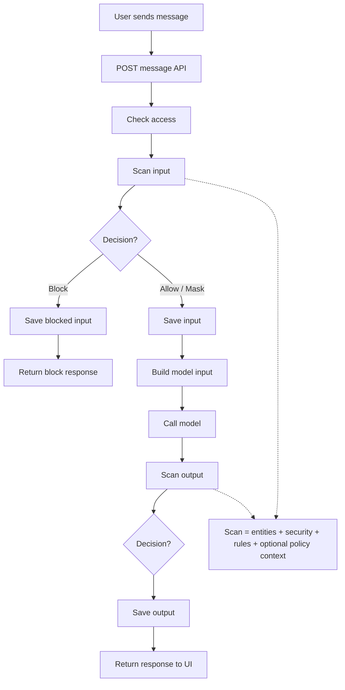

# Chat Runtime Flow

## Description
Sơ đồ này mô tả đường đi của một message trong lúc chat, từ lúc người dùng gửi vào cho đến khi hệ thống trả kết quả đã được kiểm tra an toàn.

## Mục tiêu
Sơ đồ này dùng để giải thích một message đi qua hệ thống như thế nào trong lúc chat. Trọng tâm là hệ thống kiểm tra input, quyết định `allow / mask / block`, rồi tiếp tục kiểm tra cả output của assistant trước khi trả về.

## Cách dùng khi thuyết trình
- Nói rõ hệ thống kiểm tra cả `user input` lẫn `assistant output`, không chỉ kiểm tra một chiều.
- Nhấn mạnh `Scan Engine` và `Rule Engine` là nơi tạo ra quyết định enforcement.
- Với case `block`, flow dừng sớm và không gọi chatbot.
- Với case `allow/mask`, hệ thống mới gọi LLM và sau đó scan lại output để an toàn đầu ra.

## Diagram

