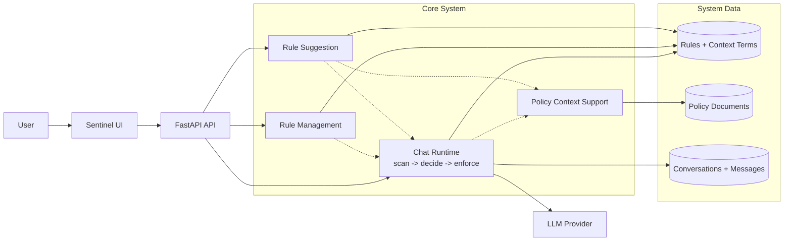

# Overall Architecture

## Description
Sơ đồ tổng quan cho thấy các khối chính của Sentinel và cách chúng liên kết với nhau trong một hệ thống bảo vệ dữ liệu khi chat với AI.

## Mục tiêu
Sơ đồ này dùng để giải thích bức tranh lớn của hệ thống Sentinel trong buổi demo. Trọng tâm là cho thấy hệ thống đóng vai trò lớp bảo vệ nằm giữa người dùng và chatbot, đồng thời có cơ chế quản lý rule và hỗ trợ cập nhật rule mới.

## Cách dùng khi thuyết trình
- Bắt đầu từ trái sang phải: người dùng thao tác trên UI, mọi request đi qua backend.
- Nhấn mạnh khối quan trọng nhất là `Chat runtime`, vì đây là nơi enforcement thật sự diễn ra.
- Giải thích `Rule management` và `Rule suggestion` là hai cách hệ thống duy trì và mở rộng policy.
- Chỉ nói `Policy context support` là phần hỗ trợ thêm ngữ cảnh cho runtime và suggestion, không phải khối trung tâm.

## Diagram

