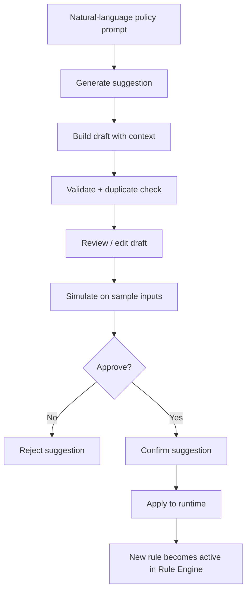

# Rule Suggestion Flow

## Description
Sơ đồ này mô tả cách một policy viết bằng ngôn ngữ tự nhiên được chuyển thành draft suggestion, sau đó được kiểm tra và đưa vào runtime dưới dạng rule thực thi.

## Mục tiêu
Sơ đồ này dùng để giải thích cách hệ thống đi từ prompt tự nhiên đến rule runtime. Trọng tâm là draft suggestion được tạo ra, được review/simulate, rồi mới được áp dụng vào runtime để ảnh hưởng kết quả enforcement thật.

## Cách dùng khi thuyết trình
- Mở đầu bằng ý: người quản trị mô tả policy bằng ngôn ngữ tự nhiên, hệ thống hỗ trợ chuyển thành draft rule.
- Nói ngắn gọn rằng hệ thống có lấy thêm policy context và kiểm tra trùng lặp trước khi đưa draft ra review.
- Nhấn mạnh bước quan trọng nhất là `simulate -> confirm -> apply`, vì đây là cầu nối từ draft sang runtime.
- Kết thúc bằng ý: sau khi apply, rule mới đi vào runtime và ảnh hưởng ngay các lần scan sau.

## Diagram

